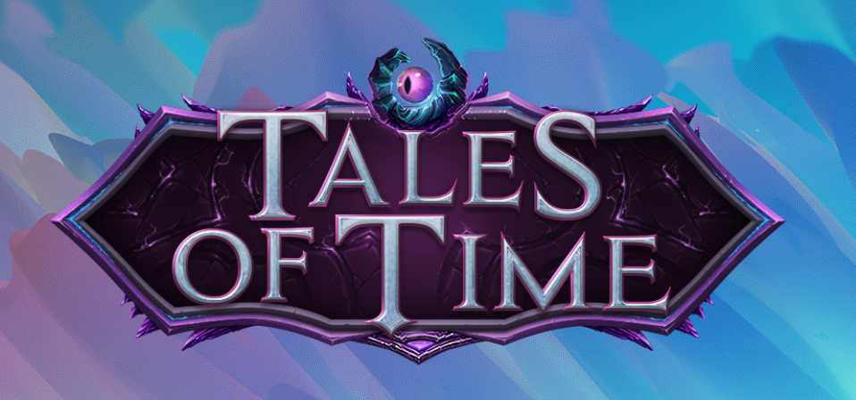

# Cross-platform Game Launcher

## Features

- Modern cross-platform support; runs equally well on Windows, OS X, Ubuntu or any other distro.
- Fully animated frontend together with responsive feedback for actions such as hovering, clicking etc.
- Live server status in the top navbar that shows the latest availability status for the game.
- One click automated game client installation.
- Live news feed that keeps the players up to date with what's going on.
- Offline-mode page that gets shown when the client is unable to reach the server.
- MD5 checksum validation of game client files to ensure that installations are successful.
- Automatic patch installation.
- Browseable extension (AddOn) store where players can customize their game client additionally.
- Download and installation progress bar to keep the user informed of what's currently going on.
- Multi-language support through modern translation pipes.
- Modern RESTful NoSQL backend with MongoDB and express. Easily extendable to create scalable, reliable and loosely coupled endpoints.

## Animated previews

